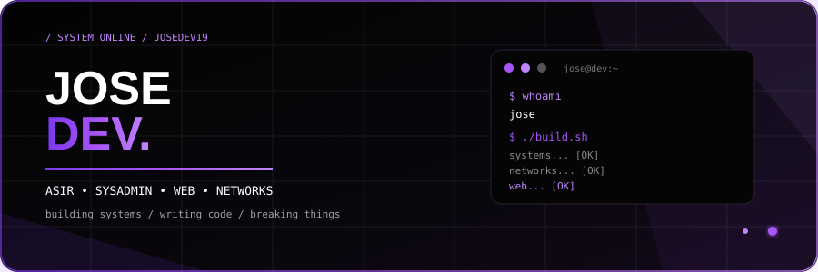

  

&nbsp;&nbsp;

 

---

<h2>01 / ABOUT</h2>

<table>
<tr>

<td width="60%" valign="top">

<h3>👋 Hey, I'm Jose</h3>

I'm an <b>ASIR student</b> focused on systems, networks and infrastructure.

I enjoy working with Linux, servers, networks and learning how
IT infrastructure works.

I also have experience creating websites and web applications.

</td>

<td width="40%" valign="top">

<pre>
USER       JoseDev19
STUDY      ASIR
FOCUS      INFRASTRUCTURE
SYSTEMS    LINUX / WINDOWS
NETWORKS   TCP/IP
STATUS     LEARNING
LOCATION   SPAIN
</pre>

</td>

</tr>
</table>

---

<h2>02 / WHAT I WORK WITH</h2>

<table>
<tr>

<td width="33%" align="center">

<h3>🖥️ SYSTEMS</h3>

Linux 
Windows Server 
Bash 
Docker 
Nginx

</td>

<td width="33%" align="center">

<h3>🌐 NETWORKS</h3>

TCP/IP 
DNS 
DHCP 
VLAN 
Networking

</td>

<td width="33%" align="center">

<h3>⚙️ INFRASTRUCTURE</h3>

Virtualization 
Servers 
System Administration 
Services 
Deployment

</td>

</tr>
</table>

---

<h2>03 / INFRASTRUCTURE</h2>

<table>
<tr>

<td width="50%" valign="top">

<h3>🐧 Linux</h3>

Working with Linux environments, users,
permissions, services, Bash and system administration.

  

</td>

<td width="50%" valign="top">

<h3>🪟 Windows Server</h3>

Learning server administration, networking,
DNS, Active Directory and remote services.

  

</td>

</tr>

<tr>

<td width="50%" valign="top">

<h3>🐳 Docker</h3>

Learning containerization and deploying
services in isolated environments.

  

</td>

<td width="50%" valign="top">

<h3>🌐 Networking</h3>

TCP/IP, DNS, DHCP, VLANs and basic
network infrastructure.

  

</td>

</tr>
</table>

---

<h2>04 / TECH STACK</h2>

  

---

<h2>05 / TERMINAL</h2>

<pre>
┌──────────────────────────────────────────────────────┐
│  ● ● ●                         jose@dev:~            │
├──────────────────────────────────────────────────────┤
│                                                      │
│  $ whoami                                            │
│  jose                                                 │
│                                                      │
│  $ focus                                             │
│  systems / networks / infrastructure                │
│                                                      │
│  $ status                                            │
│  linux................... [ OK ]                     │
│  networks................ [ OK ]                     │
│  docker.................. [ OK ]                     │
│  servers................. [ OK ]                     │
│  web..................... [ OK ]                     │
│                                                      │
│  $ echo "keep building"                              │
│  keep building_                                      │
│                                                      │
└──────────────────────────────────────────────────────┘
</pre>

---

<h2>06 / CURRENTLY</h2>

<table>
<tr>

<td width="50%" align="center">

<h3>📚 STUDYING</h3>

ASIR

</td>

<td width="50%" align="center">

<h3>🔧 LEARNING</h3>

Linux · Networks · Docker

</td>

</tr>

<tr>

<td width="50%" align="center">

<h3>⚙️ BUILDING</h3>

Infrastructure · Servers · Web

</td>

<td width="50%" align="center">

<h3>🚀 GOAL</h3>

Systems · Infrastructure · Development

</td>

</tr>
</table>

---

<h3>BUILD • LEARN • REPEAT</h3>

<b>JOSE DEV.</b>

