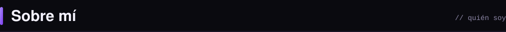
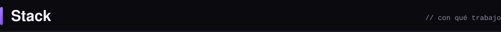
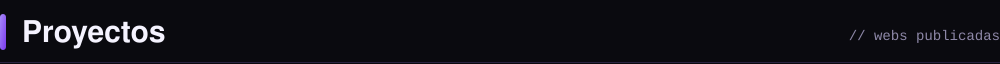
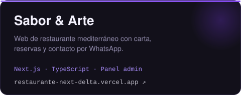
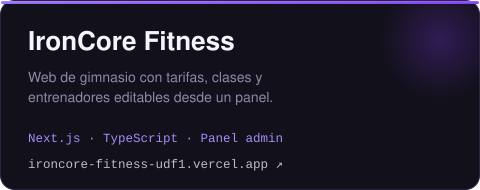
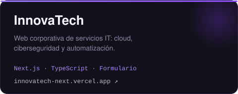
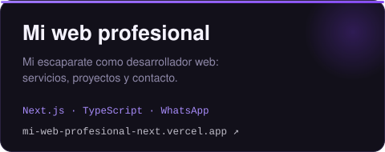
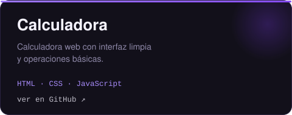
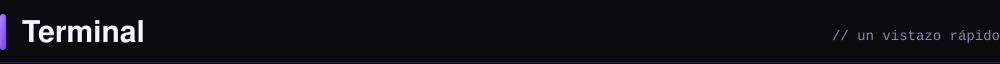
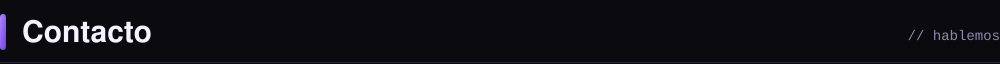

 

  

  <table> <tr> <td width="58%" valign="top">
Hola, soy José 👋

Estudiante de ASIR, enfocado en sistemas, redes e infraestructura.

Me gusta trabajar con Linux, servidores y redes, y entender cómo se gestionan las infraestructuras. También construyo webs completas con panel de administración en Next.js.

</td> <td width="42%" valign="top">
text
USER      JoseDev19
STUDY     ASIR 2026/27
FOCUS     Infra + Web
SYSTEMS   Linux / Windows Server
NETWORKS  TCP/IP · DNS · VLAN
STATUS    Learning
LOCATION  Spain
</td> </tr> </table>  

    

    

     

   

  <table> <tr> <td width="50%"><a href="https://restaurante-next-dnbwmsahz-jose-dev7.vercel.app"></a></td> <td width="50%"><a href="https://ironcore-fitness-udf1-lv4r5xfl2-jose-dev7.vercel.app"></a></td> </tr> <tr> <td width="50%"><a href="https://innovatech-next.vercel.app"></a></td> <td width="50%"><a href="https://mi-web-profesional-next-nrrav8ecz-jose-dev7.vercel.app"></a></td> </tr> <tr> <td width="50%"><a href="https://josedev19.github.io/Calculadora/"></a></td> <td width="50%"></td> </tr> </table>    

Disponible para prácticas, proyectos de infraestructura o una web para tu negocio.

 
